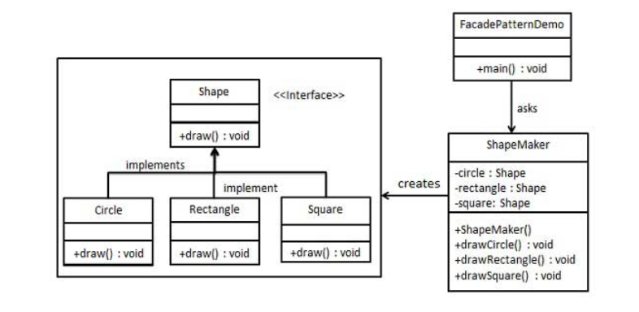
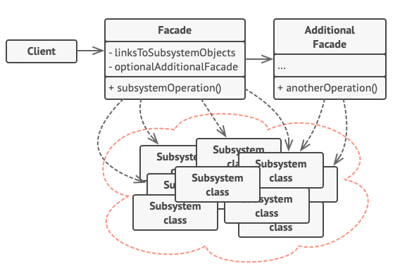

##FACADE DESIGN PATTERN
Structural Patterns: deal with the composition of classes or objects.
Facade pattern hides the complexities of the system and provides an 
interface where the client can access to the system. 
This type of design pattern comes under structural pattern as this pattern 
adds an interface to existing system to hide its complexities.

This pattern involves a single class which provides simplified methods 
required by client and delegates calls to methods of existing system classes.

Facade: Provide a unified interface to a set of interfaces in a 
subsystem. Facade defines a higher-level interface that makes the 
subsystem easier to use.
    
##PROBLEM
Imagine that you must make your code work with a broad set of 
objects that belong to a sophisticated library or framework. Ordinarily, 
you’d need to initialize all of those objects, keep track of dependencies, 
execute methods in the correct order, and so on.
As a result, the business logic of your classes would become 
tightly coupled to the implementation details of 3rd-party classes, 
making it hard to comprehend and maintain.

##SOLUTION
A facade is a class that provides a simple interface to a complex subsystem which contains lots of moving parts. A facade might provide limited functionality in comparison to working with the subsystem directly. However, it includes only those features that clients really care about.
Having a facade is handy when you need to integrate your app with a sophisticated library that has dozens of features, but you just need a tiny bit of its functionality.

##Real World Scenario
When you call a shop to place a phone order, an operator is your facade to all
services and departments of the shop. The operator provides you with a simple voice
interface to the ordering system, payment gateways, and various delivery services.

---
Instead of making your code work with dozens of the framework classes directly, creating a facade class
encapsulates all the functionalities and hides them from the rest of the code. This structure is also helpful
when upgrading or changing the version of the framework.
In fact, the only changes you’ll need are the implementation of the facade’s methods.

##HOW TO IMPLEMENT

1. Check whether it’s possible to provide a simpler interface than what an existing subsystem already provides. You’re on the right track if this interface makes the client code independent from many of the subsystem’s classes.

2. Declare and implement this interface in a new facade class. The facade should redirect the calls from the client code to appropriate objects of the subsystem. The facade should be responsible for initializing the subsystem and managing its further life cycle unless the client code already does this.

3. To get the full benefit from the pattern, make all the client code communicate with the subsystem only via the facade. Now the client code is protected from any changes in the subsystem code. For example, when a subsystem gets upgraded to a new version, you will only need to modify the code in the facade.

4. If the facade becomes too big, consider extracting part of its behavior to a new, refined facade class.

##TRADE-OFFS
The facade pattern doesn't force us to unwanted tradeoffs, because it only adds additional layers of abstraction.
Sometimes the pattern can be overused in simple scenarios, which will lead to redundant implementations.